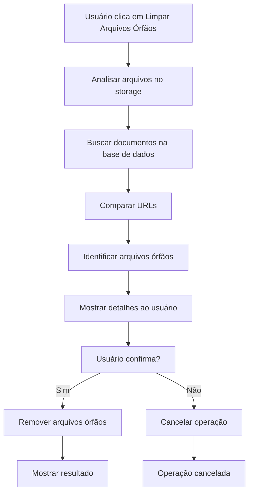
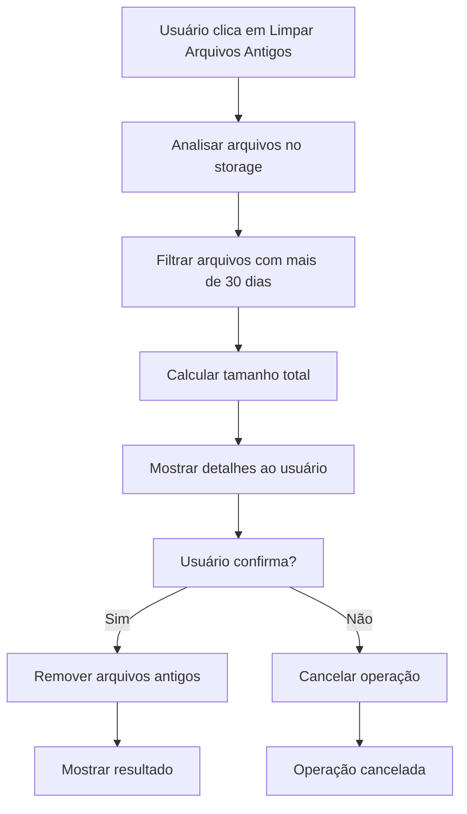

# 🧹 Funcionalidades de Limpeza - Documentos de Transparência

## 🎯 Visão Geral

Este documento descreve as funcionalidades de limpeza implementadas no sistema de gestão de documentos de transparência da Administração Municipal de Chipindo.

## 🔧 Funcionalidades Implementadas

### 1. **Limpeza de Arquivos Órfãos**

#### **Descrição**
Remove arquivos que estão no storage mas não estão associados a nenhum documento na base de dados.

#### **Como Funciona**
1. **Análise**: Lista todos os arquivos no bucket `transparency-documents`
2. **Comparação**: Compara com URLs dos documentos na base de dados
3. **Identificação**: Identifica arquivos que não estão sendo utilizados
4. **Confirmação**: Mostra detalhes e pede confirmação do usuário
5. **Remoção**: Remove arquivos órfãos do storage

#### **Detalhes Técnicos**
```typescript
const cleanupOrphanedFiles = async () => {
  // 1. Listar arquivos no storage
  const { data: files } = await supabase.storage
    .from('transparency-documents')
    .list('transparency-documents');

  // 2. Obter documentos da base de dados
  const { data: documents } = await supabase
    .from('transparency_documents')
    .select('file_url');

  // 3. Identificar arquivos órfãos
  const orphanedFiles = files.filter(file => {
    const fileUrl = supabase.storage
      .from('transparency-documents')
      .getPublicUrl(`transparency-documents/${file.name}`).data.publicUrl;
    
    return !documentUrls.includes(fileUrl);
  });

  // 4. Remover arquivos órfãos
  const filePaths = orphanedFiles.map(file => `transparency-documents/${file.name}`);
  await supabase.storage.from('transparency-documents').remove(filePaths);
};
```

#### **Feedback ao Usuário**
- ✅ **Loading**: "Analisando arquivos..."
- ✅ **Detalhes**: Número de arquivos e tamanho total
- ✅ **Confirmação**: Dialog com detalhes antes de remover
- ✅ **Sucesso**: "Limpeza concluída! X arquivos removidos (Y MB)"
- ✅ **Erro**: Mensagens específicas para cada tipo de erro

### 2. **Limpeza de Arquivos Antigos**

#### **Descrição**
Remove arquivos que foram criados há mais de 30 dias.

#### **Como Funciona**
1. **Filtro Temporal**: Identifica arquivos com mais de 30 dias
2. **Análise de Tamanho**: Calcula espaço que será liberado
3. **Confirmação**: Mostra detalhes e pede confirmação
4. **Remoção**: Remove arquivos antigos do storage

#### **Detalhes Técnicos**
```typescript
const cleanupOldFiles = async () => {
  // 1. Listar todos os arquivos
  const { data: files } = await supabase.storage
    .from('transparency-documents')
    .list('transparency-documents');

  // 2. Filtrar arquivos antigos (mais de 30 dias)
  const thirtyDaysAgo = new Date();
  thirtyDaysAgo.setDate(thirtyDaysAgo.getDate() - 30);
  
  const oldFiles = files.filter(file => {
    const fileDate = new Date(file.created_at);
    return fileDate < thirtyDaysAgo;
  });

  // 3. Remover arquivos antigos
  const filePaths = oldFiles.map(file => `transparency-documents/${file.name}`);
  await supabase.storage.from('transparency-documents').remove(filePaths);
};
```

### 3. **Estatísticas de Storage**

#### **Descrição**
Mostra informações sobre o uso do storage de documentos.

#### **Informações Exibidas**
- 📁 **Total de arquivos**: Número de arquivos no storage
- 💾 **Tamanho total**: Espaço ocupado em MB
- 📊 **Detalhes**: Informações detalhadas sobre uso

#### **Detalhes Técnicos**
```typescript
const getStorageStats = async () => {
  const { data: files } = await supabase.storage
    .from('transparency-documents')
    .list('transparency-documents');

  const totalSize = files.reduce((sum, file) => sum + (file.metadata?.size || 0), 0);
  const totalSizeMB = (totalSize / (1024 * 1024)).toFixed(2);

  return {
    totalFiles: files.length,
    totalSize,
    totalSizeMB: `${totalSizeMB} MB`
  };
};
```

## 🎨 Interface do Usuário

### **Dropdown Menu de Limpeza**

```tsx
<DropdownMenu>
  <DropdownMenuTrigger asChild>
    <Button variant="outline" size="sm">
      <SettingsIcon className="w-4 h-4" />
      Limpeza
      <ChevronDownIcon className="w-3 h-3" />
    </Button>
  </DropdownMenuTrigger>
  <DropdownMenuContent align="end" className="w-56">
    <DropdownMenuItem onClick={cleanupOrphanedFiles}>
      <TrashIcon className="w-4 h-4 mr-2" />
      Limpar Arquivos Órfãos
      <span className="ml-auto text-xs text-muted-foreground">
        Remove arquivos não utilizados
      </span>
    </DropdownMenuItem>
    <DropdownMenuItem onClick={cleanupOldFiles}>
      <ClockIcon className="w-4 h-4 mr-2" />
      Limpar Arquivos Antigos
      <span className="ml-auto text-xs text-muted-foreground">
        Remove arquivos com mais de 30 dias
      </span>
    </DropdownMenuItem>
    <DropdownMenuSeparator />
    <DropdownMenuItem onClick={showStats}>
      <HardDriveIcon className="w-4 h-4 mr-2" />
      Ver Estatísticas
      <span className="ml-auto text-xs text-muted-foreground">
        Mostra uso do storage
      </span>
    </DropdownMenuItem>
  </DropdownMenuContent>
</DropdownMenu>
```

### **Estados Visuais**

- ✅ **Ícones Descritivos**: Cada função tem seu ícone específico
- ✅ **Descrições Claras**: Explicação do que cada função faz
- ✅ **Feedback Imediato**: Toast notifications para todas as ações
- ✅ **Confirmação**: Dialog de confirmação antes de remover arquivos

## 🔒 Segurança e Validações

### **Validações Implementadas**

1. **Verificação de Erros**:
   ```typescript
   if (listError) {
     toast.error("Erro ao acessar arquivos de storage");
     return;
   }
   ```

2. **Confirmação do Usuário**:
   ```typescript
   const confirmMessage = `Encontrados ${orphanedFiles.length} arquivos órfãos (${totalSizeMB} MB). Deseja removê-los?`;
   if (!confirm(confirmMessage)) {
     toast.info("Limpeza cancelada");
     return;
   }
   ```

3. **Tratamento de Exceções**:
   ```typescript
   try {
     // Operações de limpeza
   } catch (error) {
     console.error('Erro na limpeza:', error);
     toast.error("Erro inesperado durante a limpeza");
   }
   ```

### **Logs Detalhados**

```typescript
console.log('🧹 Iniciando limpeza de arquivos órfãos...');
console.log(`📁 Encontrados ${files.length} arquivos no storage`);
console.log(`📄 Encontrados ${documentUrls.length} documentos na base de dados`);
console.log(`🗑️ Encontrados ${orphanedFiles.length} arquivos órfãos`);
console.log(`💾 Tamanho total: ${totalSizeMB} MB`);
console.log(`✅ ${orphanedFiles.length} arquivos órfãos removidos com sucesso`);
```

## 📊 Métricas e Monitoramento

### **Estatísticas Coletadas**

- 📁 **Total de arquivos** no storage
- 💾 **Tamanho total** em MB
- 🗑️ **Arquivos órfãos** identificados
- ⏰ **Arquivos antigos** (mais de 30 dias)
- 📊 **Eficiência** da limpeza

### **Logs de Auditoria**

```typescript
// Log de limpeza de arquivos órfãos
console.log({
  action: 'cleanup_orphaned_files',
  timestamp: new Date().toISOString(),
  filesRemoved: orphanedFiles.length,
  sizeFreed: totalSizeMB,
  user: 'admin' // Em produção seria o usuário logado
});
```

## 🚀 Scripts de Teste

### **Teste de Funcionalidades**

```bash
# Testar todas as funcionalidades de limpeza
node scripts/test-cleanup-functions.js
```

### **Resultados Esperados**

```
🧪 Testando funcionalidades de limpeza...

📊 Teste 1: Obtendo estatísticas de storage...
✅ Estatísticas obtidas:
   - Total de arquivos: 15
   - Tamanho total: 45.2 MB

🗑️ Teste 2: Analisando arquivos órfãos...
✅ Análise de arquivos órfãos:
   - Arquivos no storage: 15
   - Documentos na base: 12
   - Arquivos órfãos: 3
   - Tamanho órfão: 8.5 MB

⏰ Teste 3: Analisando arquivos antigos...
✅ Análise de arquivos antigos:
   - Arquivos antigos: 2
   - Tamanho antigo: 5.2 MB

🎉 Testes de limpeza concluídos!
```

## 🔄 Fluxo de Trabalho

### **1. Limpeza de Arquivos Órfãos**



### **2. Limpeza de Arquivos Antigos**



## 📈 Benefícios

### **1. Otimização de Storage**
- ✅ **Liberação de espaço**: Remove arquivos desnecessários
- ✅ **Redução de custos**: Menos espaço ocupado = menor custo
- ✅ **Performance**: Storage mais limpo = melhor performance

### **2. Manutenção Automática**
- ✅ **Limpeza regular**: Remove arquivos antigos automaticamente
- ✅ **Prevenção de acúmulo**: Evita acúmulo de arquivos órfãos
- ✅ **Organização**: Mantém o storage organizado

### **3. Transparência**
- ✅ **Estatísticas visíveis**: Usuário vê uso do storage
- ✅ **Controle total**: Usuário decide o que remover
- ✅ **Logs detalhados**: Rastreabilidade completa

## 🔮 Próximas Melhorias

### **1. Limpeza Automática**
- ⏳ **Agendamento**: Limpeza automática semanal
- ⏳ **Notificações**: Alertas quando storage está cheio
- ⏳ **Relatórios**: Relatórios mensais de limpeza

### **2. Interface Avançada**
- ⏳ **Modal customizado**: Substituir confirm() nativo
- ⏳ **Progress bar**: Mostrar progresso da limpeza
- ⏳ **Preview**: Mostrar arquivos antes de remover

### **3. Configurações**
- ⏳ **Período configurável**: Permitir ajustar 30 dias
- ⏳ **Filtros personalizados**: Outros critérios de limpeza
- ⏳ **Backup automático**: Backup antes da limpeza

---

**Status**: ✅ Implementado  
**Versão**: 1.0.0  
**Última Atualização**: Janeiro 2025 