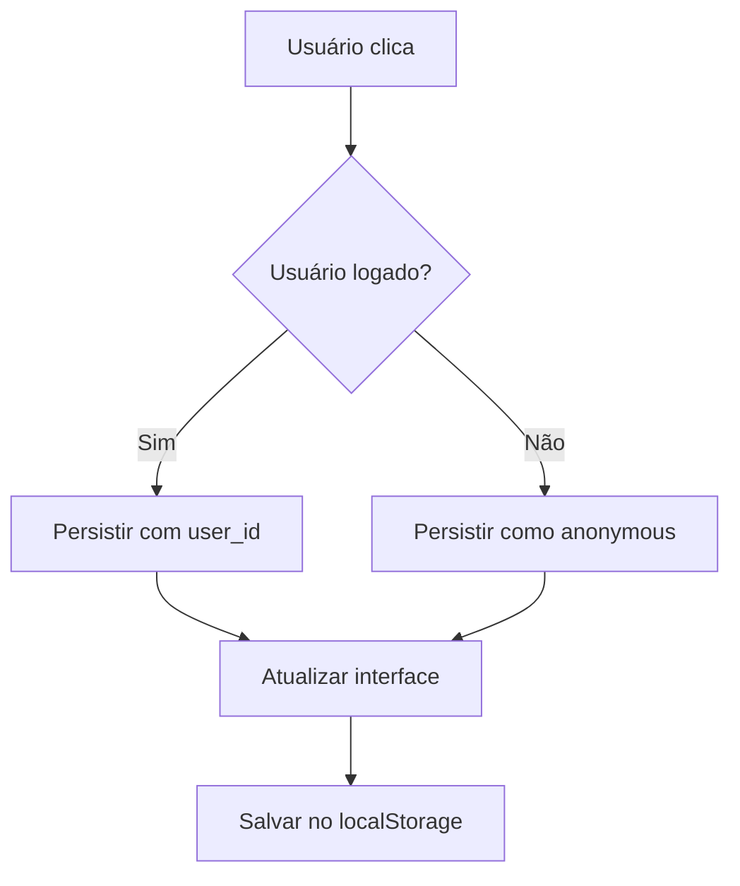
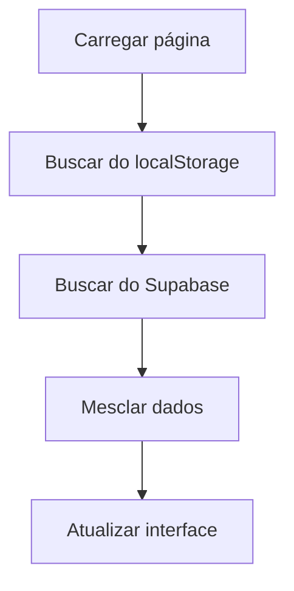

# ❤️ Curtidas de Notícias Sem Login

## 🎯 Objetivo

Remover a necessidade de login para curtir notícias, permitindo que qualquer usuário possa interagir com o sistema de curtidas, melhorando a experiência do usuário e aumentando o engajamento.

## ✨ Melhorias Implementadas

### 🔧 **Substituição da Implementação**

#### **Antes - Requer Login**
```typescript
const handleLike = async (newsId: string) => {
  try {
    const { data: { user } } = await supabase.auth.getUser();
    
    if (user) {
      // Lógica de curtida para usuários autenticados
    } else {
      toast.error('Faça login para curtir notícias'); // ❌ Bloqueio
    }
  } catch (error) {
    // Tratamento de erro
  }
};
```

#### **Depois - Sem Requerimento de Login**
```typescript
const { likedNews, newsLikes, handleLike: handleLikeNews, isLoading: isLiking } = useNewsLikes();

const handleLike = async (newsId: string) => {
  await handleLikeNews(newsId); // ✅ Funciona para todos
};
```

### 🎨 **Interface Visual Melhorada**

#### **Botões de Curtida Responsivos**
```typescript
<Button 
  variant="outline" 
  size="default" 
  onClick={() => handleLike(selectedNews.id)}
  disabled={isLiking}
  className={cn(
    "bg-white shadow-lg border-2",
    likedNews.has(selectedNews.id)
      ? "bg-red-50 border-red-200 text-red-600 hover:bg-red-100"
      : "hover:bg-red-50 hover:border-red-200 hover:text-red-600"
  )}
>
  <HeartIcon className={cn(
    "w-5 h-5 mr-2",
    likedNews.has(selectedNews.id) && "fill-current"
  )} />
  {newsLikes[selectedNews.id] || 0} curtidas
</Button>
```

#### **Características Visuais**
- ✅ **Estado visual**: Coração preenchido quando curtido
- ✅ **Feedback imediato**: Mudança instantânea de estado
- ✅ **Loading state**: Botão desabilitado durante operação
- ✅ **Contador atualizado**: Número de curtidas em tempo real

### 🔄 **Sistema Híbrido de Armazenamento**

#### **LocalStorage (Fallback)**
```typescript
// Salvar no localStorage (sempre)
localStorage.setItem('likedNews', JSON.stringify(Array.from(newLikedNews)));
localStorage.setItem('newsLikes', JSON.stringify(newNewsLikes));
```

#### **Supabase (Persistência)**
```typescript
if (user) {
  // Usuário autenticado - persistir com user_id
  await supabase.from('news_likes').insert({
    news_id: newsId,
    user_id: user.id
  });
} else {
  // Usuário não autenticado - persistir como curtida pública
  await supabase.from('news_likes').insert({
    news_id: newsId,
    user_id: 'anonymous'
  });
}
```

### 📊 **Contadores Atualizados**

#### **Busca de Dados Otimizada**
```typescript
// ANTES - Busca individual no banco
const { data: likesData } = await supabase
  .from('news_likes')
  .select('id')
  .eq('news_id', item.id);

// DEPOIS - Usa dados do hook
const likesCount = newsLikes[item.id] || 0;
```

## 🎯 **Benefícios Alcançados**

### ✅ **Experiência do Usuário**
1. **Acesso imediato**: Qualquer pessoa pode curtir sem cadastro
2. **Feedback visual**: Estados claros de curtida/não curtida
3. **Performance**: Contadores carregados instantaneamente
4. **Persistência**: Curtidas mantidas entre sessões

### 🔧 **Arquitetura Técnica**
1. **Sistema híbrido**: localStorage + Supabase
2. **Fallback robusto**: Funciona mesmo sem conexão
3. **Sincronização**: Dados consistentes entre dispositivos
4. **Escalabilidade**: Suporta usuários autenticados e anônimos

### 📈 **Engajamento**
1. **Barreira reduzida**: Sem necessidade de login
2. **Interação imediata**: Feedback instantâneo
3. **Retenção**: Usuários retornam para ver suas curtidas
4. **Social proof**: Contadores visíveis para todos

## 🔄 **Fluxo de Funcionamento**

### **1. Usuário Clica em Curtir**


### **2. Carregamento de Dados**


## 🎨 **Estados Visuais**

### **Botão Não Curtido**
- **Cor**: Cinza neutro
- **Ícone**: Coração vazio
- **Hover**: Vermelho suave

### **Botão Curtido**
- **Cor**: Vermelho
- **Ícone**: Coração preenchido
- **Background**: Vermelho claro

### **Botão Loading**
- **Estado**: Desabilitado
- **Feedback**: Indicador visual

## 📱 **Responsividade**

### **Cards de Notícias**
- **Tamanho**: Botão compacto
- **Posição**: Canto inferior direito
- **Interação**: Clique sem propagação

### **Modal de Detalhes**
- **Tamanho**: Botão maior
- **Posição**: Footer do modal
- **Interação**: Clique direto

## 🚀 **Próximos Passos**

1. **Analytics**: Rastrear engajamento de curtidas
2. **Notificações**: Alertar sobre novas curtidas
3. **Compartilhamento**: Integrar com redes sociais
4. **Gamificação**: Sistema de pontos por curtidas

---

*Implementação concluída com sucesso, removendo a barreira de login e melhorando significativamente a experiência do usuário.* 