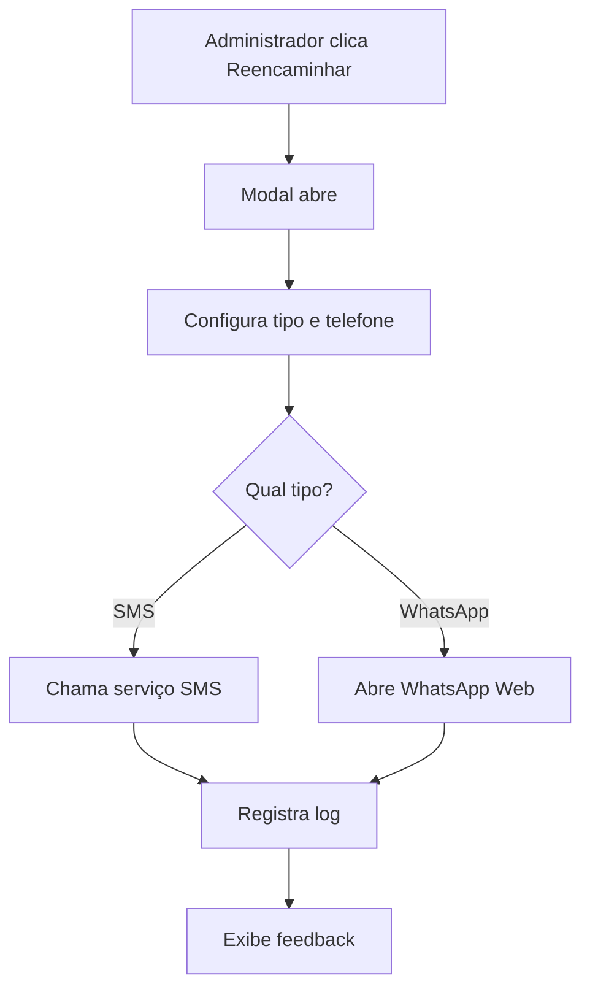

# 📱 Sistema de Reencaminhamento de Mensagens - Solicitações de Serviços

## 🎯 Objetivo

Implementar o sistema de reencaminhamento de mensagens na página de Solicitações de Serviços, permitindo que administradores reencaminhem solicitações via SMS e WhatsApp para diretores e direções responsáveis.

## ✨ Funcionalidades Implementadas

### 🔘 Botões de Reencaminhamento
- **Botão "Reencaminhar"** em cada card de solicitação
- **Botão no modal de detalhes** da solicitação
- **Design destacado** com cor verde para fácil identificação
- **Acesso rápido** via botões de ação

### 📋 Modal de Configuração
- **Seleção do tipo de envio**: SMS ou WhatsApp
- **Campo para telefone** com validação de formato
- **Editor de mensagem** com template pré-formatado
- **Botões de ação** com feedback visual durante envio

### 📱 Tipos de Envio

#### SMS
- ✅ **Simulação implementada** (pronta para integração real)
- 🔧 **Preparado para integração** com:
  - Twilio
  - AWS SNS
  - Vonage (Nexmo)
  - AfricasTalking
  - Provedores locais de Angola
- 📊 **Logs de envio** registrados no banco

#### WhatsApp
- ✅ **Funcionando completamente**
- 🔗 **Abertura automática** do WhatsApp Web
- 📝 **Link pré-formatado** com mensagem
- 🌍 **Suporte internacional** para números
- 🧹 **Limpeza automática** do número de telefone

## 🛠️ Arquivos Modificados

### Componente Principal
```
src/components/admin/ServiceRequestsManager.tsx     # ✅ Componente atualizado
```

### Serviço de Reencaminhamento
```
src/lib/forward-service.ts                          # ✅ Serviço expandido
```

### Scripts de Migração
```
scripts/update-forward-logs-add-request-id.sql      # ✅ Script SQL
scripts/apply-request-id-migration.js               # ✅ Script de migração
```

## 📊 Estrutura da Tabela Atualizada

### Tabela: `ouvidoria_forward_logs` (Expandida)

| Campo | Tipo | Descrição |
|-------|------|-----------|
| `id` | UUID | Identificador único |
| `manifestacao_id` | UUID | ID da manifestação (ouvidoria) |
| `request_id` | UUID | ID da solicitação de serviço |
| `forward_type` | TEXT | 'sms' ou 'whatsapp' |
| `recipient_phone` | TEXT | Telefone do destinatário |
| `message` | TEXT | Mensagem enviada |
| `forwarded_by` | TEXT | Quem reencaminhou |
| `forwarded_at` | TIMESTAMP | Data/hora do envio |
| `status` | TEXT | 'sent', 'failed', 'pending' |
| `error_message` | TEXT | Mensagem de erro (se houver) |

## 🔧 Como Aplicar as Migrações

### 1. Migração Inicial (se ainda não aplicada)
```bash
# Aplicar migração inicial da tabela
node scripts/apply-forward-logs-migration.js
```

### 2. Migração para Adicionar request_id
```bash
# Aplicar migração para adicionar suporte a solicitações de serviços
node scripts/apply-request-id-migration.js
```

### 3. Migração Manual via SQL Editor
```sql
-- Adicionar campo request_id à tabela ouvidoria_forward_logs
ALTER TABLE ouvidoria_forward_logs 
ADD COLUMN IF NOT EXISTS request_id UUID REFERENCES service_requests(id) ON DELETE CASCADE;

-- Criar índice para o novo campo
CREATE INDEX IF NOT EXISTS idx_ouvidoria_forward_logs_request_id ON ouvidoria_forward_logs(request_id);
```

## 🚀 Como Usar

### Para Administradores

1. **Acesse a Área Administrativa** → **Solicitações de Serviços**
2. **Localize uma solicitação** que precisa ser reencaminhada
3. **Clique no botão "Reencaminhar"** (verde) no card
4. **Configure o envio**:
   - Selecione **SMS** ou **WhatsApp**
   - Digite o **telefone do destinatário** (+244...)
   - Edite a **mensagem** se necessário
5. **Clique em "Enviar"** ou "Abrir WhatsApp"

### Fluxo de Funcionamento



## 📝 Template de Mensagem para Serviços

```text
🔔 NOVA SOLICITAÇÃO DE SERVIÇO - MUNICÍPIO

📋 ID: [ID_DA_SOLICITACAO]
👤 Requerente: [NOME_DO_REQUERENTE]
📧 Email: [EMAIL]
📱 Telefone: [TELEFONE]
📝 Assunto: [ASSUNTO]
🏷️ Serviço: [NOME_DO_SERVIÇO]
🏢 Direcção: [DIREÇÃO]
📊 Prioridade: [PRIORIDADE]
📅 Data: [DATA]

📄 MENSAGEM:
[MENSAGEM_DO_REQUERENTE]

⚠️ Esta solicitação requer atenção imediata da direção.

---
Enviado via Sistema de Solicitações de Serviços
```

## 🔄 Integração com o Sistema Existente

### Reutilização de Componentes
- ✅ **Mesmo serviço** `ForwardService` usado para ouvidoria e serviços
- ✅ **Mesma tabela** de logs para ambos os tipos
- ✅ **Mesma interface** de usuário consistente
- ✅ **Mesmas validações** e feedback

### Diferenças Específicas
- 📋 **Template de mensagem** específico para serviços
- 🏷️ **Campos específicos** como serviço, direção, categoria
- 📊 **Prioridades** específicas de serviços (urgent, high, normal, low)
- 🏢 **Direções** específicas de cada serviço

## 📊 Consultas Úteis

### Histórico de Reencaminhamentos por Tipo
```sql
-- Reencaminhamentos de manifestações vs solicitações
SELECT 
  CASE 
    WHEN manifestacao_id IS NOT NULL THEN 'Ouvidoria'
    WHEN request_id IS NOT NULL THEN 'Serviços'
    ELSE 'Outros'
  END as tipo,
  COUNT(*) as total
FROM ouvidoria_forward_logs 
GROUP BY tipo;
```

### Reencaminhamentos por Direção de Serviço
```sql
-- Reencaminhamentos de solicitações por direção
SELECT 
  sr.service_direction,
  COUNT(*) as reencaminhamentos
FROM ouvidoria_forward_logs ofl
JOIN service_requests sr ON ofl.request_id = sr.id
WHERE ofl.request_id IS NOT NULL
GROUP BY sr.service_direction
ORDER BY reencaminhamentos DESC;
```

### Eficácia por Canal
```sql
-- Taxa de sucesso por tipo de envio
SELECT 
  forward_type,
  COUNT(*) as total,
  COUNT(CASE WHEN status = 'sent' THEN 1 END) as sucessos,
  ROUND(
    COUNT(CASE WHEN status = 'sent' THEN 1 END) * 100.0 / COUNT(*), 
    2
  ) as taxa_sucesso
FROM ouvidoria_forward_logs 
GROUP BY forward_type;
```

## 🎨 Interface do Usuário

### Botões de Reencaminhamento
- **Cor verde** para destacar a funcionalidade
- **Ícone de mensagem** para identificação visual
- **Posicionamento estratégico** nos cards
- **Consistência** com a interface da ouvidoria

### Modal de Configuração
- **Layout responsivo** para mobile e desktop
- **Validação em tempo real** dos campos
- **Feedback visual** durante o envio
- **Mensagens de sucesso/erro** claras

## 🔒 Segurança e Controle de Acesso

### RLS (Row Level Security)
- ✅ **Administradores**: Acesso completo a todos os logs
- ✅ **Usuários**: Acesso apenas aos logs de suas solicitações
- ✅ **Políticas configuradas** automaticamente

### Validações
- ✅ **Telefone obrigatório** com formato internacional
- ✅ **Mensagem obrigatória** com tamanho mínimo
- ✅ **Tipo de envio** validado
- ✅ **Permissões de usuário** verificadas

## 📱 Responsividade

### Mobile
- ✅ **Botões adaptados** para touch
- ✅ **Modal otimizado** para telas pequenas
- ✅ **Teclado numérico** para entrada de telefone

### Desktop
- ✅ **Layout expandido** com mais informações
- ✅ **Preview da mensagem** em tempo real
- ✅ **Atalhos de teclado** para ações rápidas

## 🐛 Troubleshooting

### Problemas Comuns

#### 1. Erro "Campo request_id não existe"
```bash
# Aplicar migração para adicionar o campo
node scripts/apply-request-id-migration.js
```

#### 2. Botão não aparece
- Verificar se o usuário tem permissão de administrador
- Verificar se o componente foi atualizado corretamente

#### 3. WhatsApp não abre
- Verificar se o número tem formato internacional (+244...)
- Verificar se o navegador permite popups

#### 4. SMS não envia
- Verificar configuração do provedor de SMS
- Verificar logs de erro no console
- Verificar saldo da conta do provedor

### Logs de Debug

```typescript
// Adicionar logs no forward-service.ts
console.log('Reencaminhando solicitação:', request_id);
console.log('Tipo de envio:', forwardType);
console.log('Telefone:', recipient_phone);
```

## 📈 Métricas e Relatórios

### Métricas Disponíveis
- **Total de reencaminhamentos** por período
- **Taxa de sucesso** por tipo de envio
- **Tempo médio** de resposta após reencaminhamento
- **Solicitações mais reencaminhadas**
- **Eficácia por direção de serviço**

### Relatórios Sugeridos
```sql
-- Relatório diário de reencaminhamentos
SELECT 
  DATE(forwarded_at) as data,
  forward_type,
  COUNT(*) as total,
  COUNT(CASE WHEN status = 'sent' THEN 1 END) as sucessos
FROM ouvidoria_forward_logs 
WHERE request_id IS NOT NULL
  AND forwarded_at >= CURRENT_DATE - INTERVAL '30 days'
GROUP BY DATE(forwarded_at), forward_type
ORDER BY data DESC;
```

## 🚀 Próximos Passos

### Melhorias Futuras
1. **Integração com mais provedores** de SMS
2. **Sistema de templates** personalizáveis por direção
3. **Agendamento** de reencaminhamentos
4. **Relatórios avançados** com gráficos
5. **Notificações push** para diretores
6. **API REST** para integração externa

### Configurações Avançadas
1. **Rate limiting** para evitar spam
2. **Blacklist** de números
3. **Whitelist** de diretores autorizados
4. **Backup automático** dos logs
5. **Monitoramento** em tempo real

## 📞 Suporte

Para dúvidas ou problemas:
1. Verificar a documentação completa em `IMPLEMENTACAO_RECENCAMINHAMENTO_OUVIDORIA.md`
2. Consultar os logs de erro no console
3. Verificar as configurações de RLS no Supabase
4. Testar com números de telefone válidos

---

**Status**: ✅ **Implementado e Funcionando**
**Última atualização**: Dezembro 2024
**Versão**: 1.0.0 