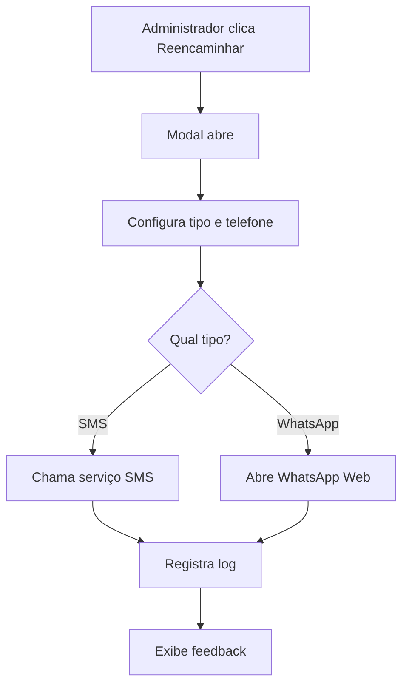

# 📱 Sistema de Reencaminhamento de Mensagens - Ouvidoria

## 🎯 Objetivo

Implementar um sistema de reencaminhamento de mensagens na Área Administrativa da página de Solicitações de Serviços (Ouvidoria), permitindo que administradores reencaminhem manifestações via SMS e WhatsApp para diretores e direções responsáveis.

## ✨ Funcionalidades Implementadas

### 🔘 Botões de Reencaminhamento
- **Botão "Reencaminhar"** em cada card de manifestação
- **Acesso via dropdown** no menu de ações (3 pontos)
- **Botão no modal de detalhes** da manifestação
- **Design destacado** com cor verde para fácil identificação

### 📋 Modal de Configuração
- **Seleção do tipo de envio**: SMS ou WhatsApp
- **Campo para telefone** com validação de formato
- **Editor de mensagem** com template pré-formatado
- **Botões de ação** com feedback visual durante envio

### 📱 Tipos de Envio

#### SMS
- ✅ **Simulação implementada** (pronta para integração real)
- 🔧 **Preparado para integração** com:
  - Twilio
  - AWS SNS
  - Vonage (Nexmo)
  - AfricasTalking
  - Provedores locais de Angola
- 📊 **Logs de envio** registrados no banco

#### WhatsApp
- ✅ **Funcionando completamente**
- 🔗 **Abertura automática** do WhatsApp Web
- 📝 **Link pré-formatado** com mensagem
- 🌍 **Suporte internacional** para números
- 🧹 **Limpeza automática** do número de telefone

## 🛠️ Instalação e Configuração

### 1. Aplicar Migração do Banco de Dados

```bash
# Opção 1: Via script Node.js
node scripts/apply-forward-logs-migration.js

# Opção 2: Manual via Supabase Dashboard
# - Acesse o Supabase Dashboard
# - Vá para SQL Editor
# - Cole o conteúdo de scripts/create-ouvidoria-forward-logs.sql
# - Execute o script
```

### 2. Verificar Estrutura de Arquivos

```
src/
├── lib/
│   ├── forward-service.ts                    # ✅ Serviço principal
│   └── sms-providers/                        # 📱 Provedores de SMS
│       ├── twilio-provider.ts               # 🔧 Exemplo Twilio
│       └── aws-sns-provider.ts              # 🔧 Exemplo AWS SNS
├── components/admin/
│   └── OuvidoriaManager.tsx                 # ✅ Componente atualizado
scripts/
├── create-ouvidoria-forward-logs.sql        # ✅ Script SQL
└── apply-forward-logs-migration.js          # ✅ Script de migração
```

## 🚀 Como Usar

### Para Administradores

1. **Acesse a Área Administrativa** → **Ouvidoria**
2. **Localize uma manifestação** que precisa ser reencaminhada
3. **Clique no botão "Reencaminhar"** (verde) no card
4. **Configure o envio**:
   - Selecione **SMS** ou **WhatsApp**
   - Digite o **telefone do destinatário** (+244...)
   - Edite a **mensagem** se necessário
5. **Clique em "Enviar"** ou "Abrir WhatsApp"

### Fluxo de Funcionamento



## 📊 Sistema de Logs

### Tabela: `ouvidoria_forward_logs`

| Campo | Tipo | Descrição |
|-------|------|-----------|
| `id` | UUID | Identificador único |
| `manifestacao_id` | UUID | ID da manifestação |
| `forward_type` | TEXT | 'sms' ou 'whatsapp' |
| `recipient_phone` | TEXT | Telefone do destinatário |
| `message` | TEXT | Mensagem enviada |
| `forwarded_by` | TEXT | Quem reencaminhou |
| `forwarded_at` | TIMESTAMP | Data/hora do envio |
| `status` | TEXT | 'sent', 'failed', 'pending' |
| `error_message` | TEXT | Mensagem de erro (se houver) |

### Consultas Úteis

```sql
-- Histórico de reencaminhamentos
SELECT * FROM ouvidoria_forward_logs 
ORDER BY forwarded_at DESC;

-- Reencaminhamentos por tipo
SELECT forward_type, COUNT(*) 
FROM ouvidoria_forward_logs 
GROUP BY forward_type;

-- Manifestações mais reencaminhadas
SELECT manifestacao_id, COUNT(*) as reencaminhamentos
FROM ouvidoria_forward_logs 
GROUP BY manifestacao_id 
ORDER BY reencaminhamentos DESC;
```

## 🔧 Integração com Serviços de SMS

### Twilio (Recomendado)

```bash
# Instalar dependência
npm install twilio

# Configurar variáveis de ambiente
TWILIO_ACCOUNT_SID=your_account_sid
TWILIO_AUTH_TOKEN=your_auth_token
TWILIO_PHONE_NUMBER=your_phone_number
```

```typescript
// No forward-service.ts, substituir a função sendSMS:
import { TwilioSMSProvider } from './sms-providers/twilio-provider';

const twilioProvider = new TwilioSMSProvider({
  accountSid: process.env.TWILIO_ACCOUNT_SID!,
  authToken: process.env.TWILIO_AUTH_TOKEN!,
  phoneNumber: process.env.TWILIO_PHONE_NUMBER!
});

// Na função sendSMS:
return await twilioProvider.sendSMS(phone, message);
```

### AWS SNS

```bash
# Instalar dependência
npm install @aws-sdk/client-sns

# Configurar variáveis de ambiente
AWS_ACCESS_KEY_ID=your_access_key
AWS_SECRET_ACCESS_KEY=your_secret_key
AWS_REGION=your_region
```

## 🎨 Personalização

### Template de Mensagem

Edite a função `generateDefaultMessage` em `forward-service.ts`:

```typescript
static generateDefaultMessage(manifestacao: any, categoryName: string): string {
  return `🔔 NOVA MANIFESTAÇÃO - OUVIDORIA MUNICIPAL

📋 Protocolo: ${manifestacao.protocolo}
👤 Solicitante: ${manifestacao.nome}
📧 Email: ${manifestacao.email}
📱 Telefone: ${manifestacao.telefone}
📝 Assunto: ${manifestacao.assunto}
🏷️ Categoria: ${categoryName}
📊 Prioridade: ${manifestacao.prioridade}
📅 Data: ${new Date(manifestacao.data_abertura).toLocaleDateString('pt-AO')}

📄 DESCRIÇÃO:
${manifestacao.descricao}

⚠️ Esta manifestação requer atenção imediata da direção.

---
Enviado via Sistema de Ouvidoria Municipal`;
}
```

### Estilo dos Botões

Modifique as classes CSS no `OuvidoriaManager.tsx`:

```tsx
<Button
  variant="outline"
  size="sm"
  onClick={() => handleForwardManifestacao(manifestacao)}
  className="flex items-center gap-2 bg-green-50 hover:bg-green-100 text-green-700 border-green-200"
>
  <MessageCircle className="w-4 h-4" />
  Reencaminhar
</Button>
```

## 🔒 Segurança

### RLS (Row Level Security)
- ✅ **Administradores**: Acesso completo a todos os logs
- ✅ **Usuários**: Acesso apenas aos logs de suas manifestações
- ✅ **Políticas configuradas** automaticamente

### Validações
- ✅ **Telefone obrigatório** com formato internacional
- ✅ **Mensagem obrigatória** com tamanho mínimo
- ✅ **Tipo de envio** validado
- ✅ **Permissões de usuário** verificadas

## 📱 Responsividade

### Mobile
- ✅ **Botões adaptados** para touch
- ✅ **Modal otimizado** para telas pequenas
- ✅ **Teclado numérico** para entrada de telefone

### Desktop
- ✅ **Layout expandido** com mais informações
- ✅ **Preview da mensagem** em tempo real
- ✅ **Atalhos de teclado** para ações rápidas

## 🐛 Troubleshooting

### Problemas Comuns

#### 1. Erro "Tabela não existe"
```bash
# Aplicar migração
node scripts/apply-forward-logs-migration.js
```

#### 2. Botão não aparece
- Verificar se o usuário tem permissão de administrador
- Verificar se o componente foi atualizado corretamente

#### 3. WhatsApp não abre
- Verificar se o número tem formato internacional (+244...)
- Verificar se o navegador permite popups

#### 4. SMS não envia
- Verificar configuração do provedor de SMS
- Verificar logs de erro no console
- Verificar saldo da conta do provedor

### Logs de Debug

```typescript
// Adicionar logs no forward-service.ts
console.log('Enviando SMS para:', phone);
console.log('Mensagem:', message);
console.log('Tipo de envio:', forwardType);
```

## 📈 Métricas e Relatórios

### Métricas Disponíveis
- **Total de reencaminhamentos** por período
- **Taxa de sucesso** por tipo de envio
- **Tempo médio** de resposta após reencaminhamento
- **Manifestações mais reencaminhadas**

### Relatórios Sugeridos
```sql
-- Relatório diário
SELECT 
  DATE(forwarded_at) as data,
  forward_type,
  COUNT(*) as total,
  COUNT(CASE WHEN status = 'sent' THEN 1 END) as sucessos
FROM ouvidoria_forward_logs 
WHERE forwarded_at >= CURRENT_DATE - INTERVAL '30 days'
GROUP BY DATE(forwarded_at), forward_type
ORDER BY data DESC;
```

## 🚀 Próximos Passos

### Melhorias Futuras
1. **Integração com mais provedores** de SMS
2. **Sistema de templates** personalizáveis
3. **Agendamento** de reencaminhamentos
4. **Relatórios avançados** com gráficos
5. **Notificações push** para diretores
6. **API REST** para integração externa

### Configurações Avançadas
1. **Rate limiting** para evitar spam
2. **Blacklist** de números
3. **Whitelist** de diretores autorizados
4. **Backup automático** dos logs
5. **Monitoramento** em tempo real

## 📞 Suporte

Para dúvidas ou problemas:
1. Verificar a documentação completa em `IMPLEMENTACAO_RECENCAMINHAMENTO_OUVIDORIA.md`
2. Consultar os logs de erro no console
3. Verificar as configurações de RLS no Supabase
4. Testar com números de telefone válidos

---

**Status**: ✅ **Implementado e Funcionando**
**Última atualização**: Dezembro 2024
**Versão**: 1.0.0 